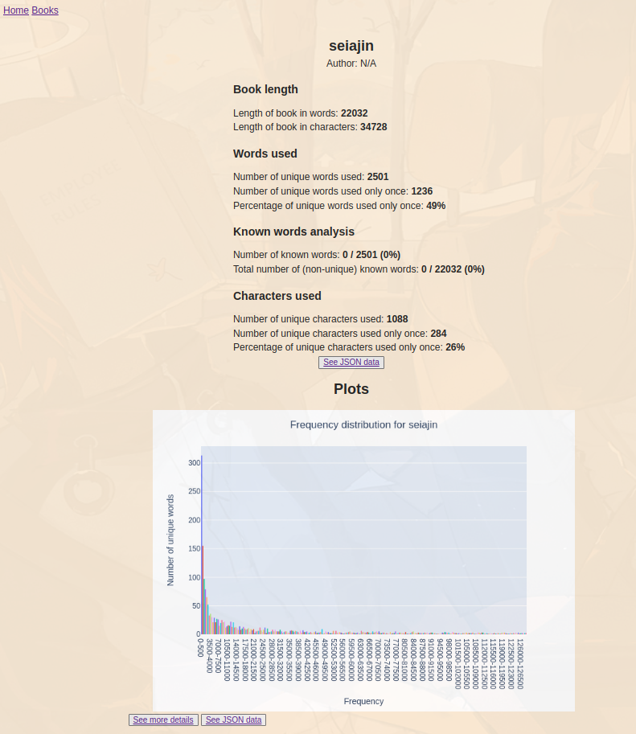

# japanese-ebook-analysis
This aim of this project is to make analysing the contents
of a Japanese ebook easy and streamline the process
for non-technical users. You can analyse an ebook, and see information
    including, but not limited to:
* The length of the book in words/characters
* The number of unique words/characters
* The number of unique words/characters only used once
* The percentage of unique words/characters only used once
* Occurence information for all words/characters that appear in the book
* Frequency distribution histograms for words

For text processing, we use [MeCab](https://taku910.github.io/mecab/) and its `python3` bindings
(https://pypi.org/project/mecab-python3/). We also use the
[mecab-ipadic-neologd](https://github.com/neologd/mecab-ipadic-neologd) neologism dictionary
to include neologisms, e.g. new words that often originated from the internet.

## Development
1. Clone repository: `git clone https://github.com/christofferaakre/japanese-ebook-analysis.git`
2. Make sure you have `mecab` and `mecab-ipadic-neologd` set up on your system.
If you're on linux or Windows WSL with the `apt` packace manager, just run the `setup.sh` script:
`./setup.sh` and then restart your shell.
Otherwise, for Linux or Mac, see
[http://www.robfahey.co.uk/blog/japanese-text-analysis-in-python/](http://www.robfahey.co.uk/blog/japanese-text-analysis-in-python/)
for a good guide on how to set it up.
If installing on Mac, you
will currently need to change the installation path to
`usr/lib/mecab/dic/mecab-ipadic-neologd` using the `-p` flag.
Trying to set up the development environment on Windows without WSL is not recommended.
3. Install python dependencies: `pip install -r requirements.txt`
4. Install other dependencies (these all need to be in your system path):
    * `pandoc`
5. Run `./app.py` (unix) or `python3 app.py` to start the flask dev server

## Usage
Currently, the project is not deployed anywhere, so to use the service,
you will need to follow the steps below in the development section first
to get the server running.
1. Upload a file containing japanese text to the server. Currently allowed
file formats:
* `.epub`
* `.txt` with utf-8 encoding. If you have a `.txt` file with different encoding,
there are many ways to change the encoding. I use this: https://github.com/Frederick-S/aozora-bunko-utf8, There is a japanese text
in the public domain in this repository that you can use for testing purposes: `data/sejain.txt`.
2. The server will redirect you to a page showing you information about the ebook.
You can then also click the 'See more details' button to see all the generated
data, including a list of all the words used together with how many occurences there
are for each word, and the same for the characters as well.

## Contributing
I'm very happy for any happy contributions! Before contributing, please
have a look at
[CONTRIBUTING.md](https://github.com/christofferaakre/japanese-ebook-analysis/blob/master/CONTRIBUTING.md). 

To see what needs work on, have a look at the repo's
[Issues](https://github.com/christofferaakre/japanese-ebook-analysis/issues)
and its
[Pull requests](https://github.com/christofferaakre/japanese-ebook-analysis/pulls). 

Feel free to submit your own issue or pull request about a new feature or anything
else. When submitting a pull request, don't be afraid to modify any of the files;
I'm not very attached to the coding style used in the repo.

## Bug reports
Please report bugs in the
[Issues](https://github.com/christofferaakre/japanese-ebook-analysis/issues)
section of the repo with the 'bug' label. Try to make your bug
report as descriptive as possible to make it easy for others to track
down the cause and potential fix of your issue.
